# BI Analyst Project

## Portada

Objetivos del proyecto:

- Analizar diferentes fuentes de datos y su nivel de aplicación en cuanto al tema a desarrollar (posiciones relacionadas a Data Science)
- Establecer un diagrama de bases de datos apropiado para la ejecución del análisis de la información
- Hacer uso de la herramienta PowerBI para la creación de las solapas
- Crear un tablero de control con análisis de los datos normalizados y recopilados en fuentes de datos abiertas

Titulo principal del proyecto: Dashboard informativo para posiciones relacionadas a Data Science

Fecha de realización: 4 de julio de 2022

Fecha de publicación: 19 de octubre de 2022

## Tabla de contenido

- [BI Analyst Project](#bi-analyst-project)
  - [Portada](#portada)
  - [Tabla de contenido](#tabla-de-contenido)
  - [Introducción](#introducción)
  - [Metodología](#metodología)
  - [Herramientas tecnológicas implementadas](#herramientas-tecnológicas-implementadas)
  - [Contenido del desarrollo](#contenido-del-desarrollo)
    - [Base de datos](#base-de-datos)
    - [Lenguaje de formulas DAX](#lenguaje-de-formulas-dax)
      - [Medidas calculadas](#medidas-calculadas)
      - [Campos](#campos)
      - [Finalidad de la medida y qué se busca analizar](#finalidad-de-la-medida-y-qué-se-busca-analizar)
    - [Visualización](#visualización)
  - [Futuras líneas](#futuras-líneas)

## Introducción

El presente proyecto se ha realizado con el fin de aplicar los conocimientos adquiridos mediante estudios autodidáctas, enfocados al análisis, recopilación y visualización de información de valor.

Para cumplir con las necesidad arriba indicada, se procederá a detallar en orden el procedimiento realizado de principio a fin haciendo uso de diferentes herramientas tecnológicas.

## Metodología

En el presente trabajo se realizó inicialmente una busqueda de datasets que comprendían datos sobre salarios de los empleos en áreas de data science; seguido se realizó inicialmente el análisis de los datos que comprendían el dataset elegido, en este caso, "Data Science Jobs Salaries", el cual fue encontrado en el repositorio *Kaglee* al cual se puede acceder a través del siguiente [link](https://www.kaggle.com/saurabhshahane/data-science-jobs-salaries)

**Esquema en estrella**: Según IBM, "*Un esquema de estrella es un tipo de esquema de base de datos relacional que consta de una sola tabla de **hechos** central rodeada de tablas de **dimensiones**.*". Dicho diagrama quedó de la siguiente forma:

## Herramientas tecnológicas implementadas

Para el presente proyecto se utilizaron las herramientas de Power BI, Excel y Visio, los cuales fueron necesarios, en el caso de Excel se utilizó en la definición de la base de datos y comprensión del dataset escogido, asimismo para el proceso de transformación al modelo estrella; para el caso de Visio fue usado para mayor comprensión de las entidades y la creación del modelo entidad relación; en el caso de PowerBI fue usado para la creación de los dashboard, medidas calculadas, transformaciones, tablas calculadas y medidas basadas en parámetros

## Contenido del desarrollo

### Base de datos

1. El dataset inicial se encontraba en formato `.csv` separado por comas, y fue seteado de forma tal que fue separado en 6 tablas principales, las cuales fueron usadas para el diseño del diagrama Entidad-Relación.

    Dataset original:

    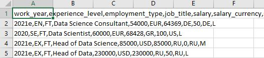

    El [dataset final](assets/Desafio4_Data_Science_Jobs_Salaries.xlsx)  fue diseñado a partir de 6 tablas extraídas y editadas del dataset original, entre otras, job, remote_ratio, company, country, employee_level y badge. Por último, el modelo de datos se diseño con un esquema en estrella.

2. Imagen del diagrama de entidad-relación de la base de datos

    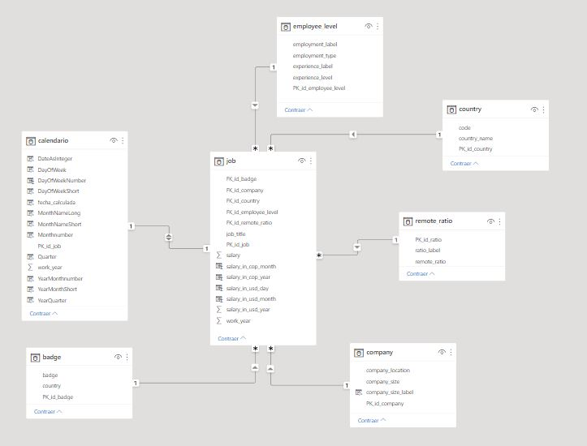

3. **Listado de columnas por tablas con tipo de datos**:

    |Tabla|Columna|Tipo de dato|
    |-|-|-|
    |job|PK_id_job|Int|
    |job|job_title|Varchar(40)|
    |job|work_year|Varchar(5)|
    |job|salary|Int|
    |job|salary_in_usd_year|Int|
    |job|FK_id_remote_ratio|Int|
    |job|FK_id_company|Int|
    |job|FK_id_badge|Varchar(5)|
    |job|FK_id_employee_level|Int|
    |-|-|-|
    |remote_ratio|PK_id_remote_ratio|Int|
    |remote_ratio|remote_ratio|Int|
    |remote_ratio|ratio_label|Varchar(20)|
    |-|-|-|
    |company|PK_id_company|Int|
    |company|company_location|Varchar(5)|
    |company|company_size|Varchar(5)|
    |-|-|-|
    |country|PK_id_country|Int|
    |country|code|Varchar(5)|
    |country|country_name|Varchar(20)|
    |-|-|-|
    |employee_level|PK_id_employee_level|Int|
    |employee_level|experience_level|Varchar(5)|
    |employee_level|experience_label|Varchar(40)|
    |employee_level|employment_type|Varchar(5)|
    |employee_level|employment_label|Varchar(20)|
    |-|-|-|
    |badge|PK_id_badge|Int|
    |badge|badge|Varchar(5)|
    |badge|country|Varchar(40)|

### Lenguaje de formulas DAX

``` SQL
-- Medidas calculada con una variable y al menos una medida de agregación

MCA Cantidad de Data Engineer con ratio codigo 3 = VAR ratio_de = CALCULATE(DISTINCTCOUNT(job[PK_id_job]), remote_ratio[PK_id_ratio] = 3, job[job_title] = "Data Engineer")
RETURN ratio_de

MCA Salario max de un Data engineer in usd year 2021 = VAR max_salary_dataengineer = CALCULATE(MAX(job[salary_in_usd_year]), calendario[work_year] = 2021, job[job_title] = "Data engineer")
RETURN max_salary_dataengineer

MCA Salario máximo en usd por año = VAR max_salary_usd = MAX(job[salary_in_usd_year])
RETURN max_salary_usd

MCA Salario promedio en usd por año = VAR promedio_salario_usd_year = AVERAGE(job[salary_in_usd_year])
RETURN promedio_salario_usd_year

-- Medida calculada con dos variables, al menos una función de agregación y una función de inteligencia de tiempo

MCA Diferencia del salario promedio por año de un Data Engineer = 
VAR promedio_2021 = CALCULATE(AVERAGE(job[salary_in_usd_year]), job[job_title] = "Data Engineer",  job[work_year] = 2021)
VAR promedio_2020 = CALCULATE(AVERAGE(job[salary_in_usd_year]), job[job_title] = "Data Engineer",  job[work_year] = 2020)
RETURN ((promedio_2020 - promedio_2021)/promedio_2020)

MCA Porcentaje de trabajo full remoto del total de registros = 
VAR ratio3 = CALCULATE(COUNT(job[job_title]),remote_ratio[PK_id_ratio] = 3)
VAR cantidad_registros = COUNT(job[job_title])
RETURN ratio3 / cantidad_registros

MCA Fecha de ultimo ingreso del mes = VAR fecha = ENDOFMONTH(calendario[fecha_calculada].[Date])
RETURN fecha

-- Medida calculada con un parámetro con al menos una función de agregación

MCA Salario en cop por mes según parámetro dolar = SUM(job[salary_in_usd_month]) * [Valor precio_dolar]

```

#### Medidas calculadas

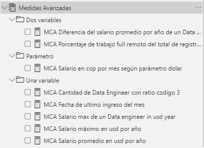

#### Campos

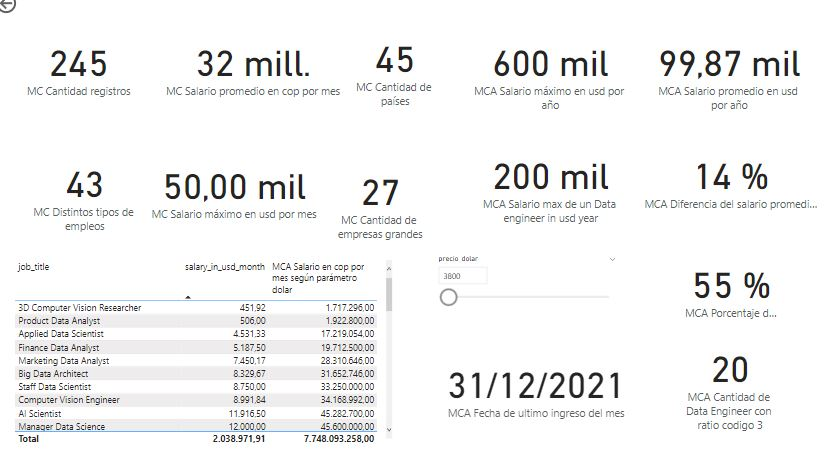

#### Finalidad de la medida y qué se busca analizar

- Medidas calculadas una variable
  - MCA Cantidad de Data Engineer con ratio codigo 3
  - MCA Salario max de un Data engineer in usd year 2021
  - MCA Salario máximo en usd por año
  - MCA Salario promedio en usd por año
- Medidas calculadas dos variables
  - MCA Diferencia del salario promedio por año de un Data Engineer
  - MCA Porcentaje de trabajo full remoto del total de registros
  - MCA Fecha de ultimo ingreso del mes
- Medida calculada con un parámetro
  - MCA Salario en cop por mes según parámetro dolar

### Visualización

1. El objetivo del presente dashboard es presentar información de valor acerca de los salarios, ubicaciones, empresas entre otros, de los empleos en el área de Data Science.
2. Alcance: El presente proyecto pretende evidencias información de valor respecto de los salarios que obtuvieron empleos de Ciencia de Datos en los años 2020 y 2021. Lo anterior, tendrá relavancia para tomar decisiones respecto al área de enfoque según ingresos y demás apartados en el que se podría especializar un usuario que se interesa en el área de Ciencia de Datos. Adicionalmente podrá utilizarse para futuras proyecciones en el sentido de reutilizar dicho proyecto en aras de combinar datos y generar información de valor.
3. Solapas del dashboard (con una breve descripción de qué información presenta y que análisis permite hacer)
   1. Portada: En esta solapa se da una presentación visual que incorpora los botones interactivos para acceder a las diferentes solapas del dashboard. En esta sección es posible identificar el objeto de análisis que comprende información relacionada con Data Science.
        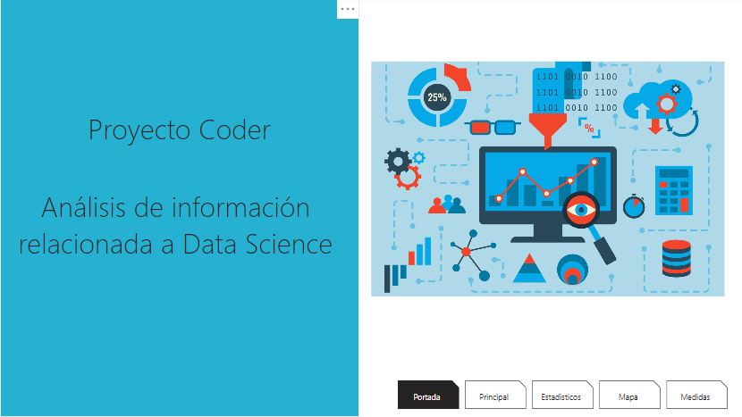
   2. Principal: En esta solapa se presenta en la parte de la izquiera filtros relacionados con país, posición, tipo de empleo, año y rango de salario; seguido se muestran medidas generales relacionadas con cantidad de países, salario mayor en usd, salario más bajo en usd, número de posiciones por país y top 5 de empleos con mayor salario al promedio. En esta primer solapa es posible analizar aspectos claves que fueron obtenidas de la Base de Datos como lo es el salario mayor y que puede tomarse como un punto relevante a la hora de hacer un análisis y que de acuerdo a la cantidad de posiciones por país se interpreta que USA es el país con mayores registros de empleos en el dataset.
        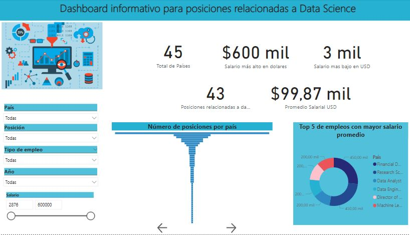
   3. Estadísticos: Se presenta una segmentación de datos en la parte de la izquierda donde se incluyen todas la posiciones (empleos) que registran en la base de datos y que dicho filtro modifica los valores del gráfico de columnas apiladas y el gráfico de líneas. En primer lugar en esta solapa es posible distinguir entre los diferentes posiciones (empleos) y que para el caso de Data Engineer se pueden aislar los datos de salario (mayor y menor) y ratio de remoto (full remote, partial remote y no remote), permitiendo así evidenciar que la mayoría de salarios superiores corresponden a empleos que son full remotos según el dataset obtenido.
        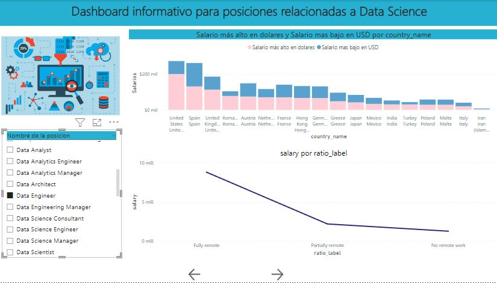
   4. Mapa: En esta sección se muestra una jerarquía del Top 15 de los menores salarios de Data Science relacionado con el nivel de empleo en una visualización de mapa de árbol.
        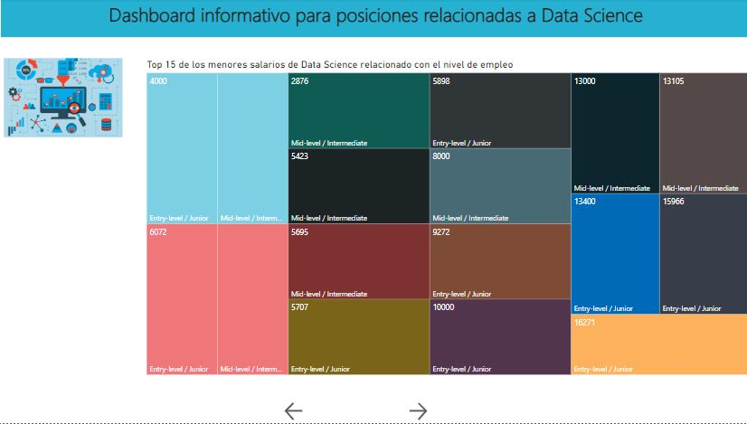
   5. Medidas: En esta solapa podemos encontrar variedad de medidas, medidas avanzadas, una tabla que contiene nombre de empleo y su correspondiente salario que puede ser modificado mediante el parámetro de precio de dolar en COP. En la presente sección es posible examinar diferentes medidas que pueden aportar valor a las anteriores secciones.
        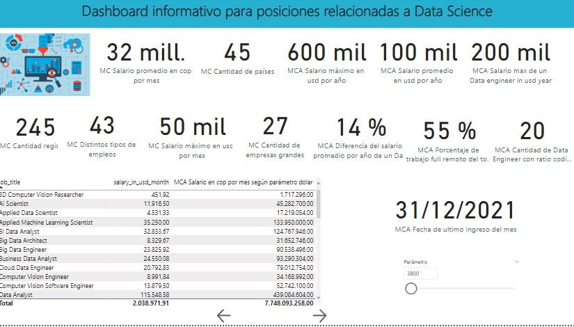
4. Diagrama Entidad - Relación: Para el diseño del presente diagrama se tuvo en cuenta que la tabla jobs se consideró como la tabla hechos por tratarse del tema principal en cuanto a los salarios de empleos en áreas de Data Science, las demás fueron clasificadas como tablas de dimensiones.

    

**Listado de tablas con PK y FK**:

- Tabla "job":

    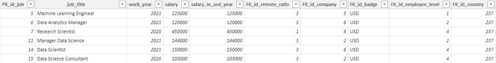

- Tabla "remote_ratio":

    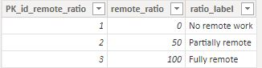

- Tabla "company"

    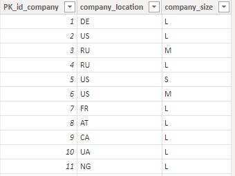

- Tabla "country"

    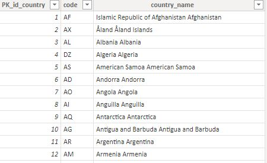

- Tabla "employee_level"

    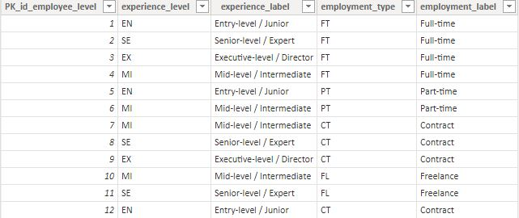

- Tabla "badge"

    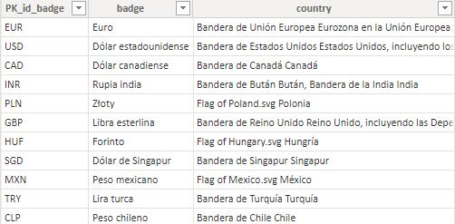

## Futuras líneas

Con este proyecto es posible impulsar un plan orientado a reconocer la evolución de los salarios para los empleos relacionados con el área de Data Science ya que el presente  se basó en los datos recopilados en los años 2020 y 2021. Adicional, para el futuro proyecto es posible unificar la información y generar mayor valor a la información que se obtenga teniendo en cuenta su evolución cronológica y también mientras se adaptan dichas posiciones a la realidad de la empresa con adopción y la evolución tecnológica.
